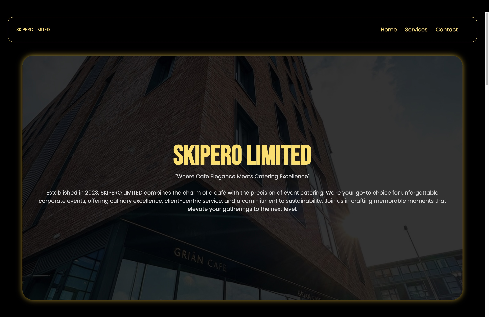
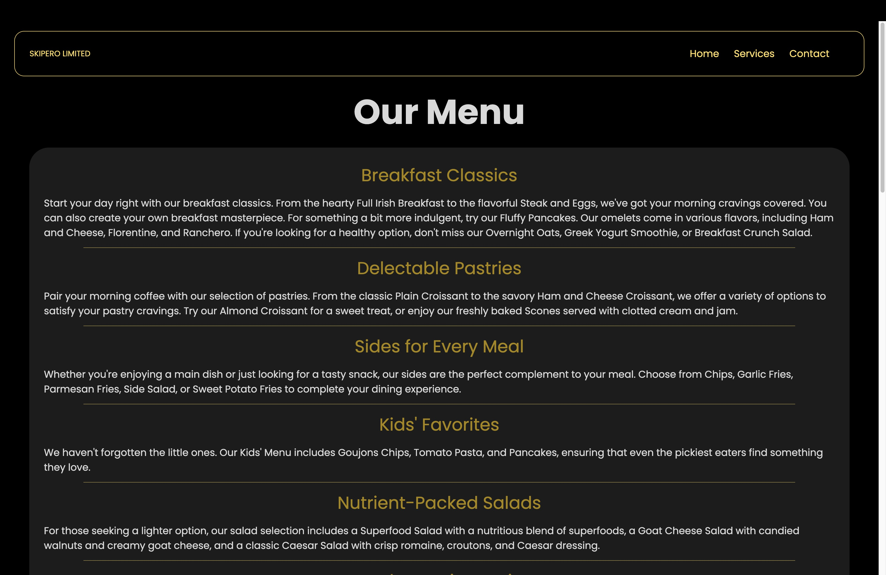
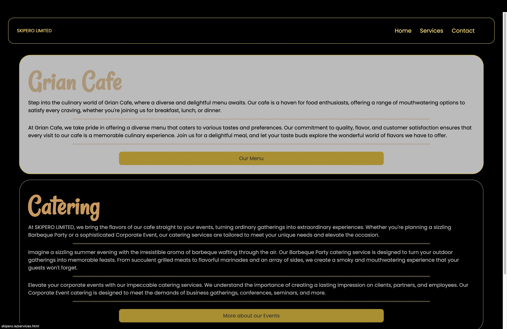

<h1>Skipero Ie</h1>

This is a website that is made for Skipero to promote their Cafe and their catering services.
<h2>General Information</h2>

<ul>
<li>This is a website hosted for a client and is used to promote their Cafe.</li>
</ul><ul>
<li>It is designed as per the theme provided.</li>
</ul><h2>Technologies Used</h2>

<ul>
<ul align="center">

 
</ul>
</ul><h2>Screenshots</h2>

<h2>Project Status</h2>

It is completed and hosted at http://skipero.ie/
<h2>Improvements</h2>

<ul>
<li>Better animations</li>
</ul><ul>
<li>Better Contact Page Design</li>
</ul><h2>Features that can be added</h2>

<ul>
<li>Seat booking facility</li>
</ul><ul>
<li>Ordering Menu Online</li>
</ul><h2>Contact</h2>

